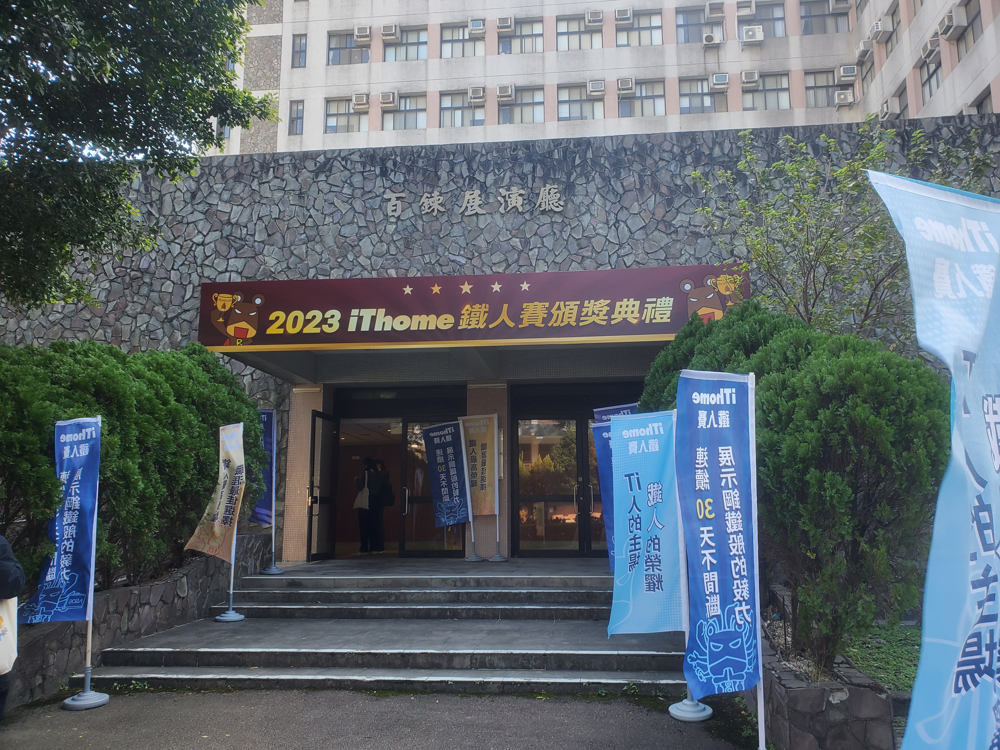
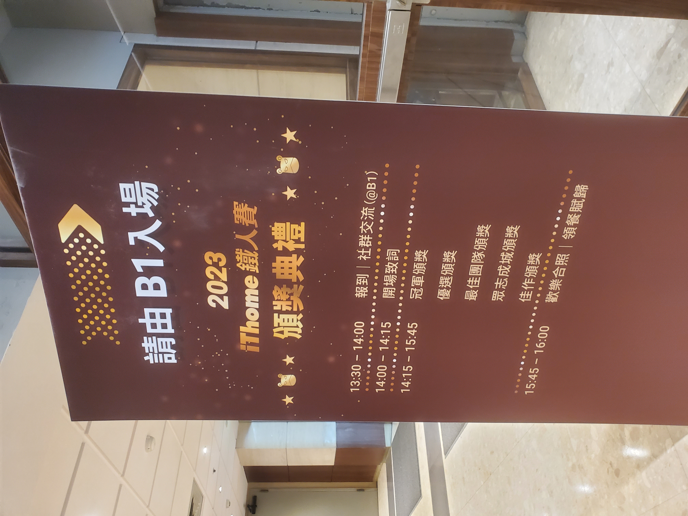
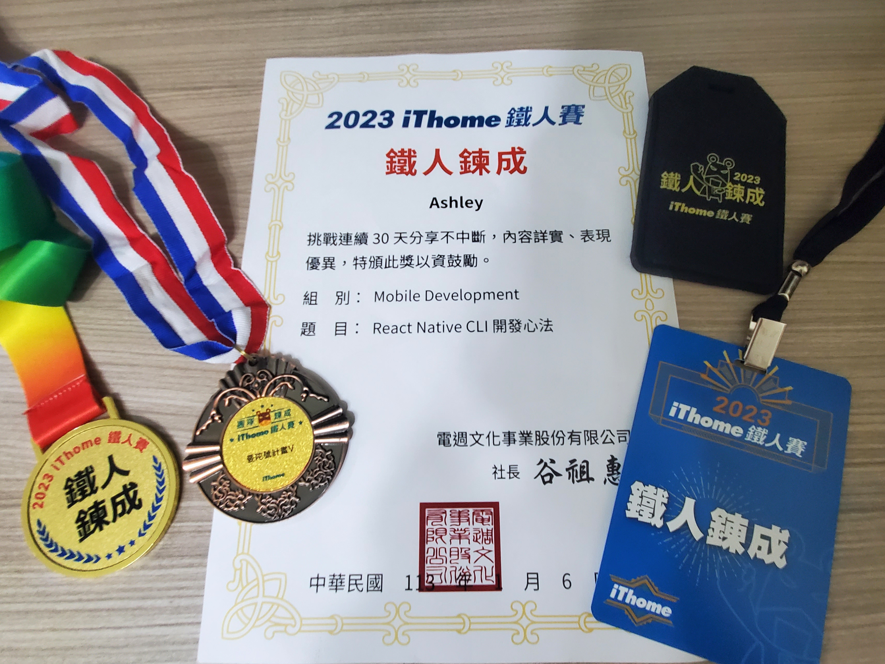
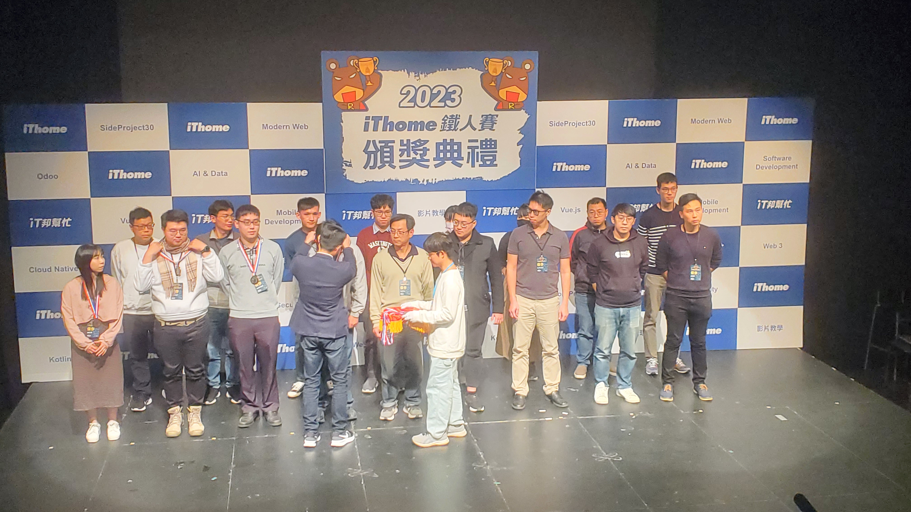

第一次參加了而且完成了 it 鐵人賽的挑戰，雖然這次沒有得獎，但好奇頒獎典禮拿獎的都會是什麼樣的人，還有會有什麼有趣的內容、再加上這次組隊的朋友拿獎了，就決定去頒獎典禮看看。

地點好像跟之前幾屆的一樣在輔大的百鍊廳，從校門口走到百鍊廳有點距離，~~想當初上次來輔大還只是個高中生~~

到了報到處，拿到了一個神秘的紙袋，裡面包含了頒獎典禮的與會吊牌，還有鐵人賽的獎狀、跟個人完賽與團賽的獎牌跟一個鐵人鍊成的紀念卡套，喔，如果有得獎的話，鐵人鍊成獎牌就要上台領獎的時候才會拿到有包含獎項名字的獎牌。（基本上，如果沒得獎的話領完就可以走了（？

卡套的裡面放了一張卡片，掃了 QRcode 就可以連結到自己的鐵人賽文章。

場地不大，有點糟的是裡面完全收不到訊號，沒網路好焦慮～

開場後就是一些重要的嘉賓致詞、評審致詞、然後冠軍得獎者致詞以下省略...

對我來說最有用的就是評審與一些得獎者講述了**撰寫鐵人賽的幾個重要的技巧**:

- 1.平常的時候就可以多搜集幾個素材，就可以此畫出一個架構延伸內容。
- 2.文章寫完一定要重新讀過一遍。
- 3.圖片的比例大小會影響閱讀文章的感受。
- 4.文章是要寫給別人閱讀的，所以字字句句需要能夠清楚表達所要傳達資訊。
- 5.最棒的題材就是你的實務經驗。

蠻有趣的是，評審有提到這次有用 ChatGpt 分析參賽者的文章做為評分的參考 XD 也有人提到他們可以辨別文章是不是 ChatGpt
寫的，方法就是看看文章有沒有錯別字，因為 it 人國文都不太好，文章多少都會有錯別字 XD

看完頒獎典禮，真心的覺得這些得獎的人真的好強，好幾個人同時報了兩組還都有拿到獎，不禁懷疑這些人都不用睡嗎？！也有人第一次參賽就拿冠軍的超厲害！

老實說，我覺得要連續不中斷寫 30 天文章(而且能兼顧文章品質的)真的太痛苦了～幸好這次是組團參加，不然我一定撐不下去的，但是藉由這次的經驗讓我好好重新把過去開發時沒弄清楚的觀念重新整理過，也是個很不錯的收穫！

下一屆如果要參加的話，我應該會先把整體的架構先理清楚，早一點把一些內容整理好，希望到時候我可以有時間參加。

這麼『痛苦』的經驗，我推薦各位工程師有機會務必要體驗一下哈哈，除了體驗將知識內化的過程，還有提升自己寫能**讓別人看得懂**的文件的能力。
