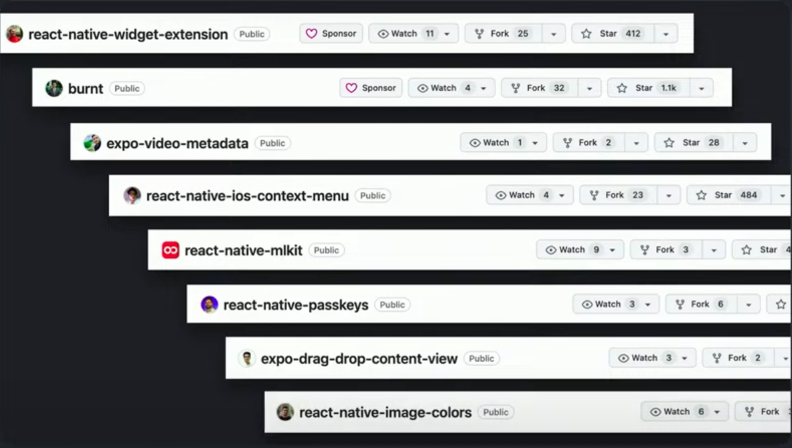
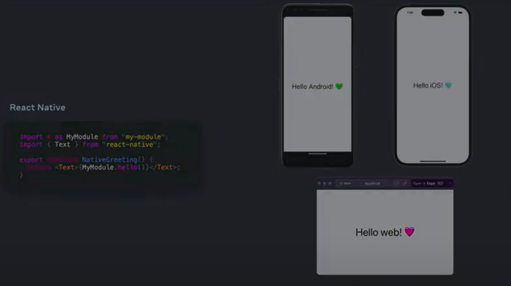
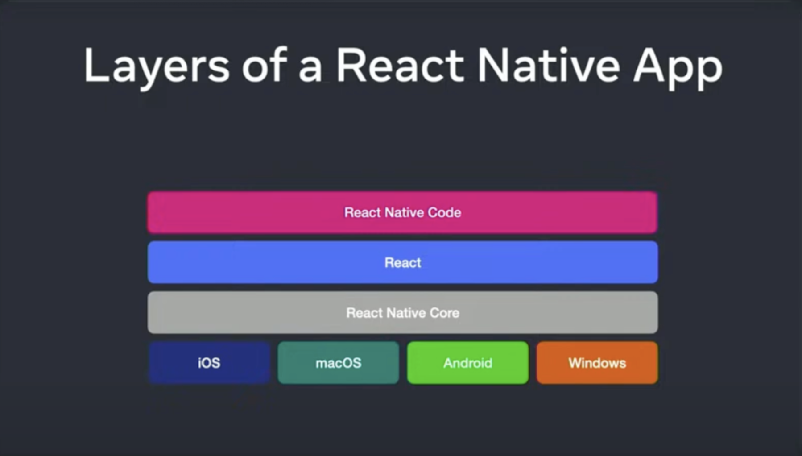
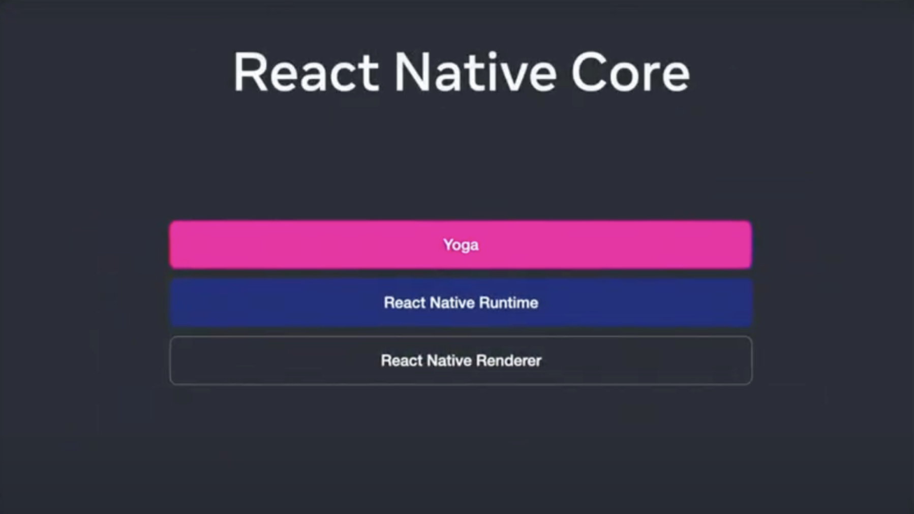
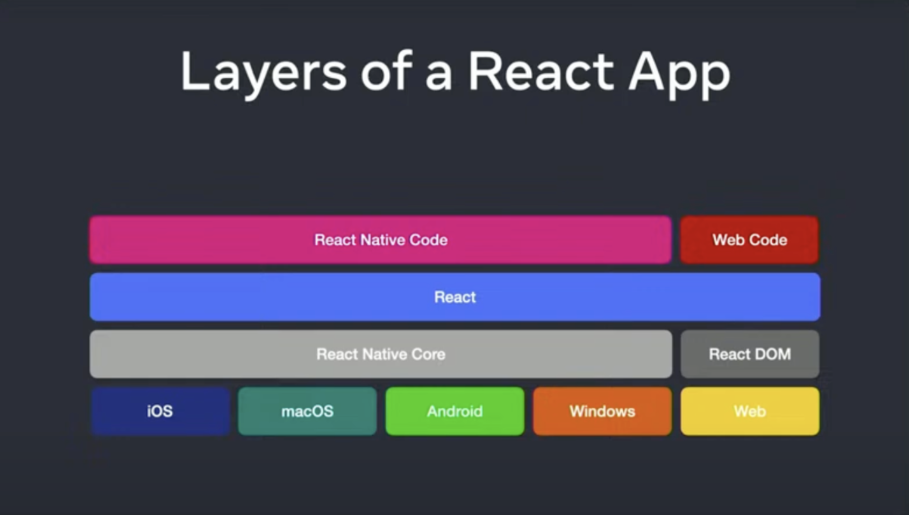
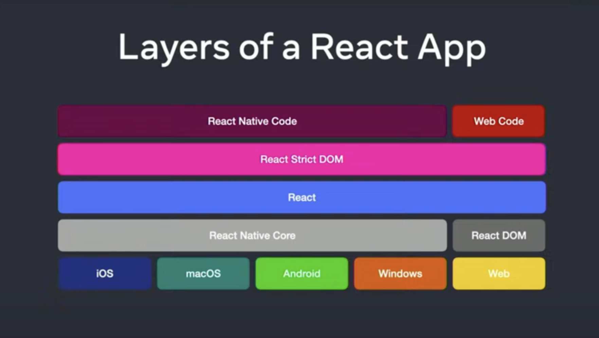

# 從 2024 React Conf 看 React Native 發展

今年的 React Conf 除了眾所矚目的 React 19 ，同時以 meta 開發團隊開發的 React Native 也帶來了不少亮點。有關於 React Native 的討論都集中在[第二天的議程](https://www.youtube.com/watch?v=0ckOUBiuxVY)。

### New Architecture 上 beta 了

截至 2024 年 3 月 React Native 的在 npm 上的每週下載數突破了220萬，越來越多的開發者使用;同時 React Native 開發團隊也宣布 New Architecture 終於上 beta 了，從 0.68 版本 2022 年 3 月在 React Native 加入了 New Architecture 到現在升級到 0.74 版本後使用 react-native-cli 可以分別在 Android 的 `gradle.properties` 啟用、iOS 則是在 iOS 的位置執行 `bundle install && RCT_NEW_ARCH_ENABLED=1 bundle exec pod install`、使用 Expo 則可以 Expo 51 的設定檔案分別開啟 iOS 跟 Android 是否支援 New Architecture。官方是建議大家可以先玩看看新架構，然後如果有遇到問題的話幫忙回報一下 issue。

<!--truncate-->

至於為什麼要改整個大改呢？這就要回歸到現在 React Native 的架構，目前的 Javascript 用 bridge 的方式和原生構通，透過 JSON 反序列化和序列化經由 bridge 來傳遞訊息，但使用 bridge 來溝通一次只能有一端通過，而且每傳遞一次就要用 JSON 反序列化和序列化來轉換資料，是相當耗費的效能的。

那麼 New Architecture 是如何改善這個問題呢？主要使用 JavaScript Interface（簡稱 JSI ）讓 JavaScript 與原生進行溝通，JSI 是用 C++ 寫的，他使用 memory sharing 的方式讓 JavaScript 層與 native 層溝通，也可以讓 JavaScript 同步運行在 native 層，直接讓 JavaScript 程式碼呼叫原生程式碼的函數，更有效率地去直接溝通原生層。

### 官方建議使用 React native framework - Expo

這次官方也宣布他們改了 [React native 的官網](https://reactnative.dev/docs/environment-setup)，從 0.75 開始版本開始，直接建議開發者使用 Framework 來開發，例如：Expo，先針對先前對於 Expo 的原生支援度不足等原因而採用 react-native-cli 作為開發選項的痛點，Expo 這次更新了一些功能以提升開發者體驗：

#### 原生的支援

對於原生的支援 Expo 提供了

- Expo sdk : 提供了一些原生的 api，例如：camera、location、notification...等
  

- Expo module api : 使用 Expo module api 可以寫自己原生 kotlin、swift 的 module 引入 React-Native 專案



#### expo router

採取 file system-based routing 的設計，分別針對 iOS 跟 Android、web 、 tv OS 給出不同的 UX 設計。

#### 管理原生程式碼

使用 continuous native generation 管理原生程式碼


整體看下來，如果 Expo 這些功能可以解決原生支援度不足、可以整合自己寫原生的引入專案、再加上整合 build 跟 deploy 的平台，整體的開發者體驗相較使用 react-native-cli 來的好很多，如果有用過 Xcode build ipa 檔案或 android command line build apk 檔案、aab 檔案就可以心領神會其中的痛苦～但是我覺得這背後有一個隱憂就是 Expo 是一間私人的公司，會不會當使用者累積到一個量後，使用 Expo 的服務就會新增一些要考量的開發成本？

順道一提，React Conf 的 App 就是使用了 Expo 開發的，當然也有包含上方提及的新功能，都可以在 https://github.com/expo/react-conf-app 的 repo 中看到實際的應用。

### 多元的開發應用

React native 除了可開發出支援 iOS 、 Android、 Mac OS 、Window 系統的應用程式，React 可以開發這麼多不同的系統，就是基於 react 可以在 Render 階段則是將 Reconciler 時定義好的描述結構轉換使用專屬的 Render 去轉成 Native 的元件。

在這一次的 conf 中可以看到 React native 也可以開發出支援 Apple vision pro 的應用程式，又 Amazon 的工程師也分享了如何 React native 去開發支援 TV OS 系統應用程式的經驗。

### React native 未來的發展

最後 Meta 的 React native 開發團隊分享了未來十年 React native 的開發藍圖：提升 React native 與 Web 的相容性與一致性，確保在不同的平台都有相同開發的體驗，以降低學習曲線。例如：ˋflexboxˋ 這個屬性在 React native 的 styleSheet 跟 CSS 在 web 瀏覽器的應用有一些不同。



#### React Native core

現行的 React Native 使用 React Native Core 將 React Element 轉換成原生的元素。



在 React Native core 中，Yoga 這個 layout 引擎負責計算 React Native layout 跟 styling 位置，後經過 React Native Runtime 後交由 React Native Renderer 去負責渲染各個平台的視圖，例如： Webview 、UI kit 、 Android ...等。

#### React DOM



React 則是使用 React DOM 將 React Element 繪製成瀏覽器實際 DOM 元素。

#### React strict DOM



為了要提升 React code sharing 以整合 codebase 在 UI 上支援 web 瀏覽器和 VR 介面...等，React strict DOM 就是基於這個目的而開發的，它可以整合 React Native 和 React ，讓 web api 也可以在 React Native 中使用。

例如：

##### Unified Styling

```jsx
import { css } from "react-strict-dom";
const styles = css.create({
  container: { borderTopWidth: 1 },
  h1: {
    padding: 10,
    backgroundColor: "#EEE",
  },
  content: {
    padding: 10,
  },
  div: {
    paddingTop: 50,
    backgroundColor: "#000",
  },
});
```

可以把 web css api 支援到 React Native ，像是偽元素、 media query。

##### Unified markup

```jsx
import { html } from "react-strict-dom";
<html.div style={style.container}>
  <html.h1 style={style.h1}>{title}</html.h1>
  <html.div style={style.content}>{children}</html.div>
</html.div>;
```

可以在 React Native 中去使用 HTML 開發 web 。


#### 結論

React strict DOM 最終的目的是讓 codebase 整合成一個，但是共享整個 codebase 跨平台並非主要的目標，應該是合理的去共享這些 code，這樣才可以花更多時間在處理各個平台的不同 UI 細節，而未來新的 web 功能將隨著時間的推移發佈到 React Native ，以提升 web 的相容性。

目前使用 React 開發 web 跟使用 React Native 開發 app 的體驗是截然不同的，在樣式方面 web 使用 css api、React Native 則是使用 styleSheet；同樣是寫 JSX 的標籤 react 不需要引用、React Native 則是需要從 React Native module 引入 component ，再加上其實有很多支援瀏覽器的屬性現階段在 React Native 是不支援的。

透過 React strict DOM 的開發可以看見開發團隊欲將 React 的生態系整合的決心，如果真的可以將 web 的 api 都可以整合到 React Native 中，那麼就可以真正的實踐 Learn once, write anywhere. ，目前看起來整合的複雜度很高、要解決的問題也不少，還需要一段時間等待。

有關於 React strict DOM 的討論可以參考這個 [RFC: React DOM for Native (reduce API fragmentation) ]https://github.com/react-native-community/discussions-and-proposals/pull/496
