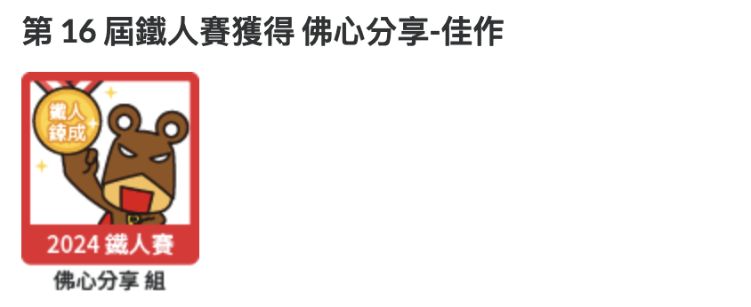
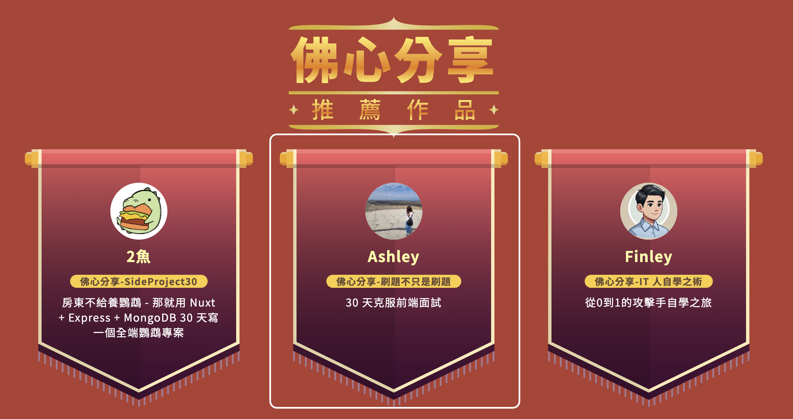

2024 年是我第二次參加 iThome 舉辦的鐵人賽，這次居然入選了 **佛心分享組的佳作**，看到自己的作品被放到 [得獎名單](https://ithelp.ithome.com.tw/2024ironman/reward) 的網站上，真是感到非常意外啊！

<!--truncate-->

這次選擇參加佛心分享組就是沒想要跟別人比賽，這樣寫起來壓力比較不會那麼大，雖然還是有連續 30 天發文的壓力，但是主要還是想聚焦於自己，把參加的過程當成一個練習。

參賽的初衷就只是想要加強自己前端技能，想要更清楚的把過去不太懂的知識點再加強，重新梳理一遍，練習用自己的話寫出來，大概就是一個跟自己比賽的過程，因為我很常半途而廢，能完成就覺得很不錯了，更何況得了一個小小的獎，實在是受寵若驚（？）

這次鐵人賽的作品：
https://ithelp.ithome.com.tw/users/20162496/ironman/7698

同時也有整理在這邊：
https://wintersprouter.github.io/frontend-notes/docs/tags/2024-i-t鐵人賽

這次好像有得到一個 2024 賽季紀念品，等到時候收到再分享上來。
