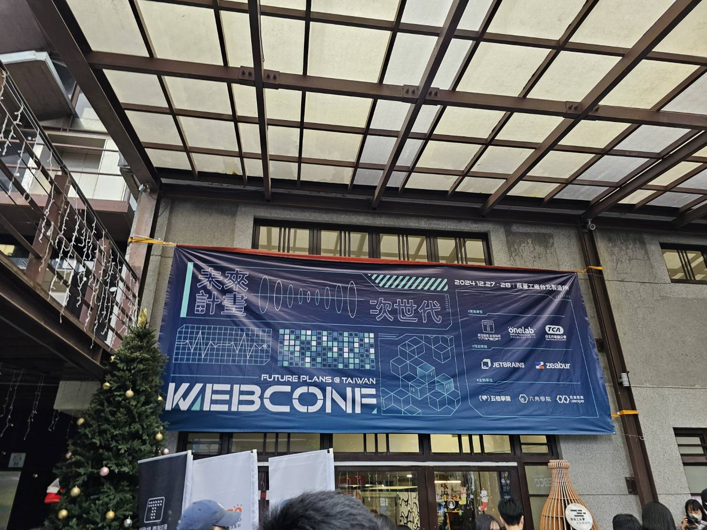
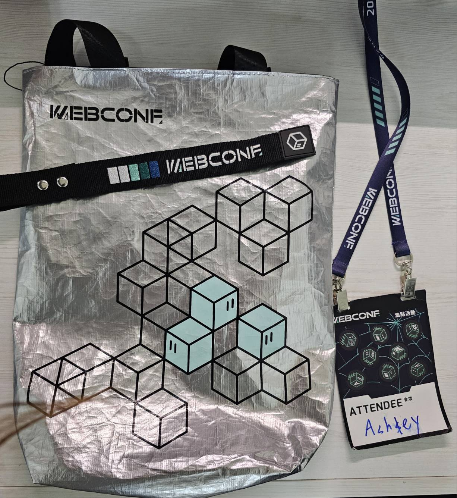
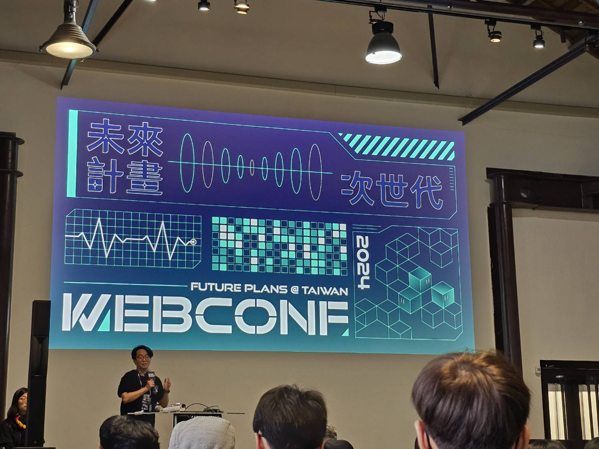
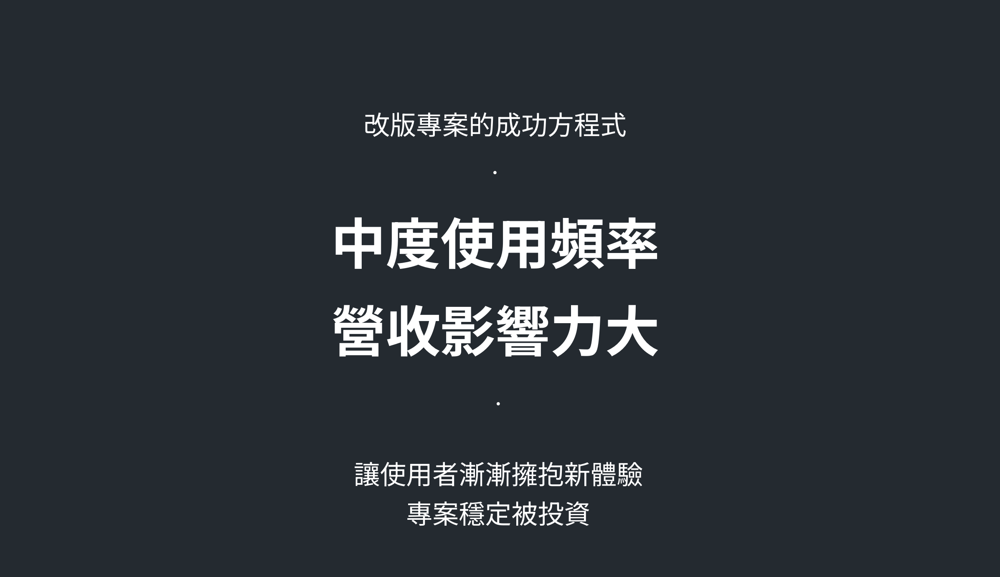
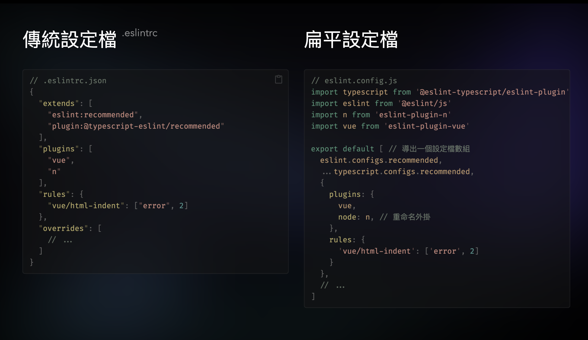
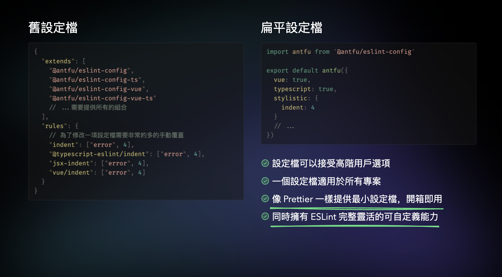
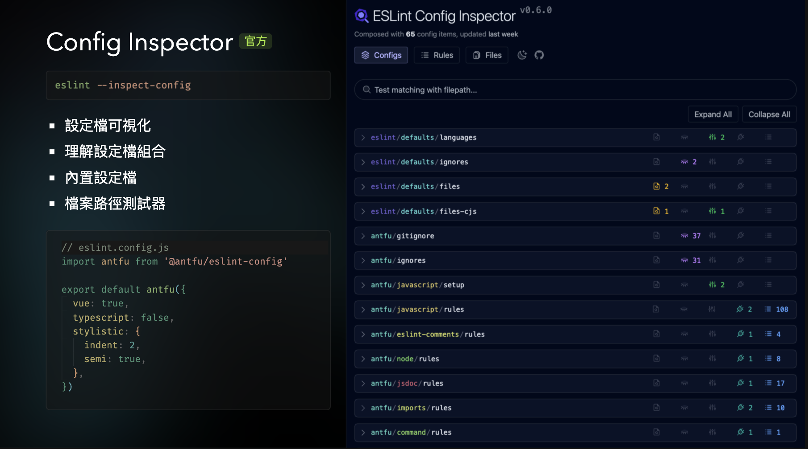
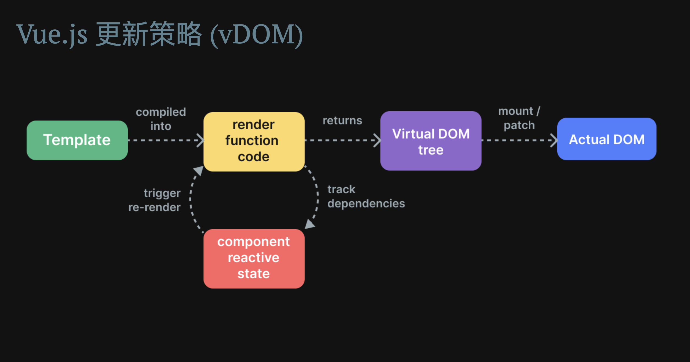
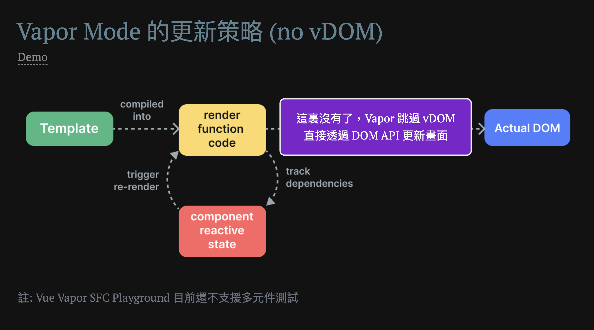

import { HTMLPreview } from "../../src/components/mdx/index.js";



## 2024 WebConf

第二次 參加 Web Conf ，這次的議程一樣精彩豐富，甚至有幾個議程同時排在一起讓我一時難以抉擇。兩天的聽完的心得大致上是覺得有些收穫的，對於技術迭代的知識焦慮倒是還好，因為平常就有在看這些東西，所以這次議程有些內容對我來說也算是複習，當然也還是有得到一些新的知識與觀點。

<!--truncate-->



## 回顧

以下就我有聽的議程且較有印象的內容做一個回顧：



### 1. 有限狀態機與 RxJS - 奶綠茶

有限狀態機與 RxJS 這兩個題目剛好我都不熟。
在前端的開發中很常會需要實作狀態的管理，在這個議程中講者用紅綠燈的案例很清楚的說明了什麼是有限狀態機。

有限狀態機（Finite State Machine, FSM）包括以下幾個特色：

- 同一時間點，只會出存在一種狀態
- 有限數量的狀態 state
- 有限數量的事件 event 一定在時間內轉換到下一個狀態
- 一個 initial state
- 一個轉換的函式，傳入當下事件跟狀態去轉換狀態
- n 個 final state

就紅綠燈來說基本上同時間只會有一個狀態，綠、黃、紅，而且燈號的轉換事件數量是有限的且有規則可循的。

使用有限狀態機的目的就是用來收斂需求的規格，讓狀態結構更加清晰，提升可維護性，而且使用現成的有限狀態機 library [xstate](https://github.com/statelyai/xstate)可以讓狀態圖易於視覺化，有助於工程師與設計師理解整個邏輯流程。

[RxJS](https://rxjs.dev/) 則是一個基於 functional programming 精神設計的 library，透過 Observable 來處理複雜的非同步事件流，可以將多個運算符組合再一起，讓程式碼更加簡潔，也更容易閱讀。

適合用來實作拖拉的功能，例如：拖拉的過程中會有 mousemove 事件，這個事件會不斷觸發，透過 RxJS 可以很容易的處理這個事件流，並且可以透過運算符來過濾掉不必要的事件。

稍微看了一下 RxJS 文件，看起來要使用需要花一點時間學習，感覺有點複雜。對了，除了技術上的知識，講者有提到建議大家去閱讀熱門開源專案的程式碼。

### 2. 個人專案到產品：善用 AI 工具打造可盈利產品 - 王鵬傑 PJ Wang

這場是 Explian this 的作者，我很常閱讀他們家的文章，甚至曾有想付費訂閱，但是覺得要讀的東西太多，感覺負荷不了就作罷。講者分享他們怎麼去選擇 side project 的題目，還有打造產品的流程與思路。

[product hunt](https://www.producthunt.com/) 是個適合參考選題的地方。

雖然我沒有要做 side project 的打算，但是整場我必須說最有共鳴的應該是寫 side project 還是要找價值觀跟個性接近的同伴一起，當然不只是寫 side project ，很多時候都是。

### 3. 如何撰寫具彈性的測試程式 - Summer

[如何撰寫具彈性的測試程式逐字稿](https://www.cythilya.tw/2024/12/27/webconf2024-ui-causes-testing-to-fail/)

這場內容本身很棒，但是這些內容已經有在他的書裡面寫過，我也剛好讀過了...。

### 4. 十年回首：React 的過去、現在與未來發展 - Zet

[簡報](https://slides.com/tz5514/react-webconf2024)

這場我覺得有點可惜的是前面講者花了太多時間在描述 React 的渲染策略，這些他的書裡面都有，我也讀過了:[《React 思維進化》讀書筆記](https://wintersprouter.github.io/frontend-notes/docs/category/react-%E6%80%9D%E7%B6%AD%E9%80%B2%E5%8C%96%E8%AE%80%E6%9B%B8%E7%AD%86%E8%A8%98)
。

最有收穫的部分是 React Fiber 底層架構，由於多任務處理能力的需求增加：CPU、data data fetch，在改成 React Fiber 之前，React component 在 render 階段會產生的一個遞迴 stack 的 virtual dom tree，這個過程是不可中斷的，又 Javascript 是單執行緒的，所以當 React component 在 render 階段遇到一個很大的 component 就會佔用瀏覽器的 main thread，這樣就會造成瀏覽器的畫面卡住。

在有了 React Fiber 之後，React component 在 render 階段改成使用 Linked list 代替一般的樹狀結構的儲存畫面結構，而且可以透過 scheduler 機制去調度產生畫面的流程。

至於 Server Components 的部分，因為一直沒有機會實作，所以對於這個部分的內容還是有點模糊，這就留到以後有時間再來研究吧。

後面談到了一些今年發表的 React 19 和 React Compiler 的部分，剛好今年 react conf 我剛好有看完，所以焦慮感沒那麼重 ＸＤ ，react conf 的內容很精彩關於新的特性講了非常多細節，這邊就不多贅述了。

### 5. 《天下》如何思考數位敘事？從流程到技術大公開 - 李郁欣／楊時鈞 Steven Yeo

這場主要是分享天下雜誌他們家的前端怎麼應用 blender 3d 建模將圖資結合新聞敘述打造一篇數位的專題報導，他們的專題報導是真的蠻炫砲的，完全是跟我不同的前端領域，聽完我就在想這樣的產生一篇新聞的成本好重，可是敘事的手法真的很不錯。

當然除了技術上覺得佩服，還有一個是我覺得厲害的地方，就是需要跟中央的研究單位專家索取適合應用在 3D 建模的資料，那中間的溝通真的很難，通常外部的人不太懂前端技術上需要的資料結構，還必續要花時間去解釋。

### 6. 從商業策略出發的產品、服務體驗設計：以 USPACE 產品為例 - 郭丞哲 Doppler kuo

這家做的產品跟我現在做的很雷同，聽完覺得果然痛點都差不多，但某些想法是可以參考的。

### 7. AI+商業思維：軟體工程師如何擁抱趨勢，提升職場價值 - 游舒帆

[AI+商業思維：軟體工程師如何擁抱趨勢，提升職場價值](https://gipi.tw/webconf-2024-ai-and-business-thinking/?fbclid=PAZXh0bgNhZW0CMTEAAaY5PcBALpCOpZD5RzIadmhqLa7Kf_7frPdLOImYHiSh5HZhTYYRSgtnJo4_aem_Fc3cQo6Us5KC8MXHxoa5Lw)

比較軟一點的職涯分享內容，講的蠻好的，讓人重新思考在自己職涯與市場的定位，雖然這些內容我好像在以前在曼陀號聽過。

### 8. 擁抱漸進式體驗 — 設計驅動企業改革動能 - 郭藺瑩 Lydia Kuo

很精彩的一場，無論是敘事或是簡報設計都是很舒服的一場，前面開頭分享了很多小故事很吸引人，透過這些故事讓人了解到只有實際走入使用者的生活，才能夠設計出動人人心的產品。接著是我覺得最有幫助的是改版專案，專案改版其實是實務上很常見的狀況，講者以改版 Yahoo! 股市 APP 為例，分享他們團隊進行 APP 改版的思路。



透過前期的使用者訪談研究，先盤點出 APP 功能對使用者重要性的順序，接著從中度使用頻率的功能而且影響營收的功能進行改版，除了讓使用者可以漸漸接受改版，進而藉由改版後的營收彰顯改版的成效，讓專案可以獲得穩定的投資與支持，才有資源接著下一階段的改版，畢竟能活下去是才是最重要的。

另外一個有收穫的地方是，講者提到一個可以幫助設計師與前端工程師提升開發效率的工具，就是使用 figma 的 Global token，讓設計的 UI 可以被清楚的定義好規格，再加上 [style-dictionary](https://github.com/amzn/style-dictionary?tab=readme-ov-file#installation) 可以把定義好的 JSON 規格檔案轉換成相對應的 CSS、SCSS、或者 Android 、IOS程式碼，這樣就可以讓設計師與前端工程師之間的溝通更加順暢，也可以節省掉前期定義設計規格的時間，更重要的是，當設計需要改版時只要調整前面的定義規格檔案，就可以自動更新到所有的程式碼，節省了很多時間，讓工程師與設計師可以更專注於開發與設計上。

### 9. ESLint One for All Made Easy - Anthony Fu

[ESLint One for All Made Easy 簡報](https://talks.antfu.me/2024/webconf-tw/1)
他的簡報超酷，除了簡報內容本身，還有為簡報講解開發的功能。

Eslint Flat Config 是 eslint 9.0.0 版本重大的改版，在聽到這場之前我已經花了一些時間把目前維護的專案的 eslint 遷移到 Flat Config，所以對我來說還算是不陌生，但是在聽完這場後有發現更多可以玩的東西。



Flat Config 相較傳統的設定檔好處在於扁平化的設定大大的提升靈活性與可以擴展化的彈性，讓多個專案可以共享同一份設定檔，覆蓋所有不同類型的專案。


後面講者介紹了一些 library 、還有一些 eslint 9.0.0 的功能。


ESLint Config Inspector 這個工具超酷，可以幫你把目前專案的 eslint 設定檔轉換成可視化的開發工具，檢視目前專案哪些檔案應用了哪些規則，哪些規則已經被棄用。

#### eslint 應用多樣性

1. linter
2. 遷移工具： [eslint-plugin-command](https://github.com/antfu/eslint-plugin-command)
3. 格式化工具: [ESLint Stylistic](https://eslint.style/)
4. 多種語言的 linter

### 10. Flex out！ CSS Grid 玩起來！ - 李建杭 Amos

[簡報下載](https://drive.google.com/file/d/1ZgN-oDsIazHd3kYt-bPWM1tOap7VGBLF/view)

Grid 其實對我來說不陌生，有時候用 Grid 排版超好用，當然還是有一些我不知道 CSS 技巧，以下就講者的提供範例做一個回顧：

[範例程式碼](https://drive.google.com/file/d/1aaH7wncnXp1ydu-C_V9_ez19oPG_j08D/view)

#### 使用 details 製作純 CSS 手風琴式版面

```html
<!DOCTYPE html>
<html lang="en">
  <head>
    <meta charset="UTF-8" />
    <meta name="viewport" content="width=device-width, initial-scale=1.0" />
    <title>keywords auto height transition - by Amos</title>
    <style>
      :root {
        interpolate-size: allow-keywords;
      }
      .accordion-item {
        margin: 30px;
        border: 1px solid #aaa;
      }
      .accordion-item .detail-title {
        background-color: #ccc;
        padding: 10px;
      }
      .accordion-item .detail-title::marker {
        content: "";
      }
      .accordion-item .detail-content {
        padding: 10px;
      }
      /* Animation */

      /* 選擇所有具有 accordion-item 類別的元素內的 details-content 偽元素。 */
      .accordion-item::details-content {
        /* 設定 height 和 content-visibility 屬性的過渡效果，持續時間為 0.5 秒，使用 ease 過渡效果。 */
        transition:
          height 0.5s ease,
          content-visibility 0.5s ease allow-discrete;
        height: 0;
        /* 內容超出範圍時裁剪。 */
        overflow: clip;
        /* 強制內容可見。 */
        content-visibility: visible !important;
      }
      /* 選擇所有具有 accordion-item 類別且有 open 屬性的元素內的 details-content 偽元素。 */
      .accordion-item[open]::details-content {
        /* details-content 偽元素的高度設為 auto，並使用 calc-size(auto) 來計算自動高度。 */
        height: auto;
        height: calc-size(auto);
      }
      /* 這樣當 accordion-item 被打開時，details-content 的高度會從 0 過渡到自動計算的高度，實現手風琴效果的展開動畫。 */
    </style>
  </head>
  <body>
    <h1>使用 details 製作純 CSS 手風琴式版面</h1>

    <div class="accordion">
      <details class="accordion-item" name="item">
        <summary class="detail-title">Q : 金魚都能懂什麼？</summary>
        <div class="detail-content">
          <p>
            「金魚都能懂」的教學系列是由 Amos
            創立，目的是為了讓大家在學習過程可以更加輕鬆自在且愉快...
          </p>
        </div>
      </details>
      <details class="accordion-item" name="item">
        <summary class="detail-title">Q : 這段秀什麼？</summary>
        <div class="detail-content">
          <p>
            這段展現「不」使用 grid 也能夠實現不確定容器高度時的動畫轉換效果
          </p>
          <p>
            使用 HTML Details 和 interpolate-size: allow-keywords; 實現 height
            auto。
          </p>
        </div>
      </details>
      <details class="accordion-item" name="item">
        <summary class="detail-title">
          Q : 實現自動高度動畫真的不難，對吧
        </summary>
        <div class="detail-content">
          <p>來個長假文吧</p>
          <p>
            我個人認為義大利麵就應該拌42號混泥土，因為這個螺絲釘
            的長度很容易直接影響到挖掘機的扭矩。你往裡砸的時候，一瞬間它就會產生大量
            的高能蛋白，俗稱UFO，會嚴重影響經濟的發展，以至於對整個太平洋，和充電器的核污
            染。再或者說透過這勾股定理很容易推斷出人工飼養的東條英雞，他是可以捕獲野生
            的三角函數，所以說不管這秦始皇的切面是否具有放射性，川普的N次方是否有沈澱物，
            都不會影響到沃爾瑪跟維爾康在南極匯合。
          </p>
        </div>
      </details>
    </div>
  </body>
</html>
```

<HTMLPreview
showCode={false}

code={`     <h1>使用 details 製作純 CSS 手風琴式版面</h1>
    <div class="accordion">
        <details class="accordion-item" name="item">
            <summary class="detail-title">Q : 金魚都能懂什麼？</summary>
            <div class="detail-content">
                <p>「金魚都能懂」的教學系列是由 Amos 創立，目的是為了讓大家在學習過程可以更加輕鬆自在且愉快...</p>
            </div>
        </details>
        <details class="accordion-item" name="item">
            <summary class="detail-title">Q : 這段秀什麼？</summary>
            <div class="detail-content">
                <p>這段展現「不」使用 grid 也能夠實現不確定容器高度時的動畫轉換效果</p>
                <p>使用 HTML Details 和 interpolate-size: allow-keywords; 實現 height auto。</p>
            </div>
        </details>
        <details class="accordion-item" name="item">
            <summary class="detail-title">Q : 實現自動高度動畫真的不難，對吧</summary>
            <div class="detail-content">
                <p>來個長假文吧</p>
                <p>我個人認為義大利麵就應該拌42號混泥土，因為這個螺絲釘 的長度很容易直接影響到挖掘機的扭矩。你往裡砸的時候，一瞬間它就會產生大量 的高能蛋白，俗稱UFO，會嚴重影響經濟的發展，以至於對整個太平洋，和充電器的核污 染。再或者說透過這勾股定理很容易推斷出人工飼養的東條英雞，他是可以捕獲野生 的三角函數，所以說不管這秦始皇的切面是否具有放射性，川普的N次方是否有沈澱物， 都不會影響到沃爾瑪跟維爾康在南極匯合。</p>
            </div>
        </details>
    </div>
  `}

style={ `
        :root{
            interpolate-size: allow-keywords;
        }
        .accordion-item {
            margin: 30px;
            border: 1px solid #aaa;
        }
        .accordion-item .detail-title {
            background-color: #ccc;
            padding: 10px;
        }
        .accordion-item .detail-title::marker {
            content: '';
        }
        .accordion-item .detail-content {
            padding: 10px;
        }
        /* Animation */
        .accordion-item::details-content {
            transition: height 0.5s ease, content-visibility 0.5s ease allow-discrete;
            height: 0;
            overflow: clip;
            content-visibility: visible!important;
        }
        .accordion-item[open]::details-content {
            height: auto;
            height: calc-size(auto);
        }` }
height="300px"
/>

##### [interpolate-size](https://developer.mozilla.org/en-US/docs/Web/CSS/interpolate-size)

```css
:root {
  interpolate-size: allow-keywords;
}
```

是一個 實驗性 CSS 屬性，它允許在 length-percentage（例如具體數值如 50% 或 200px）和內在尺寸值（例如 auto、fit-content 或 max-content）之間進行動畫或過渡（interpolation）。

allow-keywords：
開啟 length-percentage 和內在尺寸值（例如 auto）之間的插值動畫。
適用於動畫場景，例如容器在「折疊（closed）」和「展開（open）」狀態之間平滑過渡。

##### [details](https://developer.mozilla.org/zh-TW/docs/Web/HTML/Element/details)

details 元素，可以用來包裹一段內容，並且可以透過 summary 元素來控制內容的顯示與隱藏。

#### 使用 ch 代替 em 讓尺寸控制更精確

```html
<!DOCTYPE html>
<html lang="en">
  <head>
    <meta charset="UTF-8" />
    <meta name="viewport" content="width=device-width, initial-scale=1.0" />
    <title>CSS Grid table - by Amos</title>
    <style>
      .table {
        display: grid;
        /* 第一列的寬度為 calc(3em + 9ch)，即 3 個字母寬度加上 9 個字符寬度。
接下來的兩列寬度為 1fr，即各佔剩餘空間的 1 份。*/
        grid-template-columns: calc(3em + 9ch) repeat(2, 1fr);
        /* grid-template-columns: 12em repeat(2, 1fr); */
        gap: 2px;
      }
      .row {
        display: grid;
        /* 使用 subgrid 來繼承父網格容器（即 .table）的列定義。*/
        grid-template-columns: subgrid;
        grid-column: 1/-1;
      }
      .col {
        border: 1px solid #aaa;
        /* 設定內邊距為上下 1ex（字體高度的 x 高度），左右 1em（字母寬度）。*/
        padding: 1ex 1em;
      }
    </style>
  </head>
  <body>
    <h1>使用 ch 代替 em 讓尺寸控制更精確</h1>
    <div class="table">
      <div class="row">
        <div class="col">A123456789</div>
        <div class="col">Amos</div>
        <div class="col">sample@gmail.com</div>
      </div>
      <div class="row">
        <div class="col">K123456789</div>
        <div class="col">Alvee</div>
        <div class="col">sample@gmail.com</div>
      </div>
      <div class="row">
        <div class="col">G123456789</div>
        <div class="col">Ray</div>
        <div class="col">sample@gmail.com</div>
      </div>
      <div class="row">
        <div class="col">M123456789</div>
        <div class="col">Eason</div>
        <div class="col">sample@gmail.com</div>
      </div>
    </div>
  </body>
</html>
```

<HTMLPreview
showCode={false}
code={`

    <h1>使用 ch 代替 em 讓尺寸控制更精確</h1>

    <div class="table">
        <div class="row">
            <div class="col">A123456789</div>
            <div class="col">Amos</div>
            <div class="col">sample@gmail.com</div>
        </div>
        <div class="row">
            <div class="col">K123456789</div>
            <div class="col">Alvee</div>
            <div class="col">sample@gmail.com</div>
        </div>
        <div class="row">
            <div class="col">G123456789</div>
            <div class="col">Ray</div>
            <div class="col">sample@gmail.com</div>
        </div>
        <div class="row">
            <div class="col">M123456789</div>
            <div class="col">Eason</div>
            <div class="col">sample@gmail.com</div>
        </div>
    </div>

`}
    style={
    ` .table {
display: grid;
grid-template-columns: calc(3em + 9ch) repeat(2, 1fr);
gap: 2px;
}
.row {
display: grid;
grid-template-columns: subgrid;
grid-column: 1/-1;
}
.col {
border: 1px solid #aaa;
padding: 1ex 1em;
}` }
height="300px"
/>

##### em

是相對於父元素的字體大小，英文字母最寬的寬度。

##### ex

是一種相對單位，表示相對於當前元素字體中小寫字母 "x" 的高度（也稱為 "x-height"）。（字體高度的 x 高度）。

##### ch

是一種相對長度單位，用於表示與字體中數字 "0" 的寬度相關的尺寸。這個單位主要用於設計需要字寬基準的布局，例如表格、輸入框或排版。

#### color-mix 函式 - by Amos

```html
<!DOCTYPE html>
<html lang="en">
  <head>
    <meta charset="UTF-8" />
    <meta name="viewport" content="width=device-width, initial-scale=1.0" />
    <title>color-mix 函式 - by Amos</title>
    <style>
      :root {
        --btn-bg: #fa0;
        --btn-hover-bg: #fff;
      }
      html,
      body {
        height: 100%;
        place-content: center;
        text-align: center;
      }
      .btn {
        display: inline-block;
        padding: 1ex 3em;
        background-color: var(--btn-bg);
        color: #fff;
        font-size: 22px;
        margin: 6px;
        border: none;
      }
      .btn:nth-child(1):hover {
        background-color: color-mix(
          in srgb,
          var(--btn-bg),
          var(--btn-hover-bg) 20%
        );
      }
      .btn:nth-child(2):hover {
        background-color: color-mix(
          in srgb,
          var(--btn-bg),
          var(--btn-hover-bg) 50%
        );
      }
      .btn:nth-child(3):hover {
        background-color: color-mix(
          in srgb,
          var(--btn-bg),
          var(--btn-hover-bg) 80%
        );
      }
    </style>
  </head>
  <body>
    <button class="btn">按鈕色彩控制</button>
    <button class="btn">按鈕色彩控制</button>
    <button class="btn">按鈕色彩控制</button>
  </body>
</html>
```

<HTMLPreview
showCode={false}

code={`     <button class="btn">按鈕色彩控制</button>
    <button class="btn">按鈕色彩控制</button>
    <button class="btn">按鈕色彩控制</button>
  `}

style={ `:root {
            --btn-bg: #fa0;
            --btn-hover-bg: #fff;
        }
        html,body{
            height: 100%;
            place-content: center;
            text-align: center;
        }
        .btn {
            display: inline-block;
            padding: 1ex 3em;
            background-color: var(--btn-bg);
            color: #fff;
            font-size: 22px;
            margin: 6px;
            border: none;
        }
        .btn:nth-child(1):hover {
            background-color: color-mix(in srgb, var(--btn-bg), var(--btn-hover-bg) 20%);
        }
        .btn:nth-child(2):hover {
            background-color: color-mix(in srgb, var(--btn-bg), var(--btn-hover-bg) 50%);
        }
        .btn:nth-child(3):hover {
            background-color: color-mix(in srgb, var(--btn-bg), var(--btn-hover-bg) 80%);
        }` }
height="300px"
/>

##### [color-mix](https://developer.mozilla.org/en-US/docs/Web/CSS/color_value/color-mix)

用於混合兩種顏色，根據指定的比例生成一種新的顏色。這個函式對於設計需要漸變、對比或平滑過渡效果的場景非常有用。

### 11. 當 Vue 與 View 分手之後⋯ - Kuro Hsu

講者在這場介紹了 Vue 的一個實驗性的功能: **Vue Vapor Mode**

現行的 Vue 更新渲染策略是生成 Virtual Dom ，可以避免開發者直接去修改 DOM element，但是這樣同時也產生一些缺點，產生 Virtual Dom 會影響記憶體與執行的效率，也會增加了打包後的大小，在大型的專案特別明顯。



Vue Vapor Mode 是可以讓 Vue 不用生成 Virtual Dom，而是直接使用 DOM API 去更新畫面，如此一來可以讓 Vue 更快更輕量。

- Vue Vapor Mode 實作 template 模板

[vuejs/vue-vapor 原始碼](https://github.com/vuejs/vue-vapor/blob/db140a1e37f89590e52d788a8d12308f53c7f3f1/packages/runtime-vapor/src/dom/template.ts)

```js
/*! #__NO_SIDE_EFFECTS__ */
export function template(html: string) {
  let node: ChildNode
  const create = () => {
    // eslint-disable-next-line no-restricted-globals
    //highlight-next-line
    const t = document.createElement('template')
    //這裡可以看到 Template 是一個使用 DOM API document.createElement('template') 的實例
    t.innerHTML = html
    return t.content.firstChild!
  }
  return () => (node || (node = create())).cloneNode(true)
}
```

- Vue Vapor Mode 實作 \_setText 和 \_setHtml

[vuejs/vue-vapor 原始碼](https://github.com/vuejs/vue-vapor/blob/db140a1e37f89590e52d788a8d12308f53c7f3f1/packages/runtime-vapor/src/dom/prop.ts#L188)

簡單來說就是透過檢查舊的 DOM 節點的值，如果新的值和舊的值不同，就更新 DOM 節點的值。

```js
export function setText(el: Node, ...values: any[]) {
  const text = values.map(v => toDisplayString(v)).join('')
  //舊的 textContent 值 oldVal
  const oldVal = recordPropMetadata(el, 'textContent', text)
  if (text !== oldVal) {
    //更新 el.textContent 為新的 text 值
    el.textContent = text
  }
}

export function setHtml(el: Element, value: any) {
  //舊的 innerHTML 值 oldVal
  const oldVal = recordPropMetadata(el, 'innerHTML', value)
  if (value !== oldVal) {
    el.innerHTML = value
  }
}
```



Vue Vapor Mode 的實作是基於 @vue/reactivity ，@vue/reactivity 則是由 vue 將其響應式系統抽出來變成獨立套件，即使沒有安裝 Vue 也可以使用響應式的api，甚至可以在後端處理 websocket 事件的狀態管理，更支援深層物件結構。

響應式系統核心在於首次使用 effect 函式時會去自動追蹤內部所有響應式狀態，狀態被修改時，更新並且執行 side effect 並且移除 render()。

至於無 virtual dom 的會不會是前端的趨勢?我個人覺得除非 React 使用量被 Vue 超越很多或哪天 react 放棄了 react native，不然 virtual dom 對於 react 來說是很重要的，畢竟 react 同時要支援多個跨平台 ex: android、ios、web，而 virtual dom 連接跨平台原生元件的重要橋樑。

不過說真的如果 Vue 的 Vapor Mode 真的上線之後，看起來效能會比 React 好很多。
