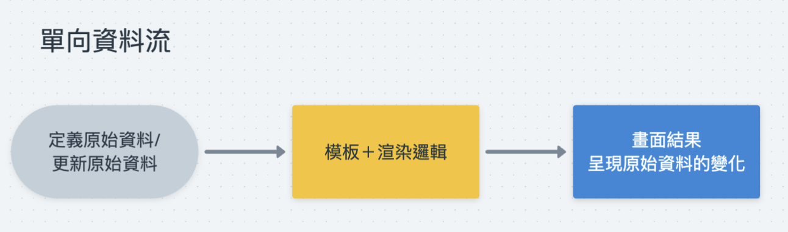

## 單向資料流的概念

單向資料流指的是一種畫面與資料流管理的設計模式，原始資料變動會驅動畫面的更新，透過原始資料與模板綁定後渲染產生畫面，當資料變動時，畫面才會去更新。在資料傳遞的過程中，是單向的而且不可以被修改的，這樣可以確保畫面不會因為資料在更新以外的地方被修改而導致畫面的不一致，畫面也不會去修改原始資料。

透過單一資料來源可以實踐將畫面與資料分離管理，使用原始資料來驅動畫面的更新，這樣可以讓畫面的狀態變得可預測，也可以讓程式碼變得更容易維護，這是因為資料的變動只會是由開發者去控制，而畫面結果也只會是因為資料的變動與渲染邏輯去產生。

## 實現單向資料流常見的渲染策略

### 渲染策略一：根據資料變動的範圍更新 DOM 元素

就是依據原始資料更新的內容，開發者自行判斷有哪些 DOM 元素需要更新，然後透過操作 DOM 元素的方法手動去更新畫面。

#### 優點：

＊ 減少不必要的 DOM 元素操作，同時減少效能的浪費。

#### 缺點：

＊ 依賴開發者人工判斷，當應用程式架構龐大複雜時，不易維護與管理，容易出錯。

#### 使用該策略的前端框架：Vue

Vue 透過資料與模板的綁定，當監聽到資料發生改變時，Vue 會自動去更新 DOM 元素，這樣就不用開發者手動去操作 DOM 元素。

### 渲染策略二：一律重繪

當資料更新後，會將原來的 DOM 元素全部清除，然後重新根據新的原始資料去重新繪製畫面。

#### 優點：

＊ 開發者不用在乎資料更新的內容，只要定義好原始資料與模板定義、渲染邏輯就好，不用手動去更新 DOM 元素。

#### 缺點：

＊ 效能不佳，因為先把整個 DOM 全部清空，再操作 DOM 元素，如此一來操作 DOM 元素的次數過多，會導致畫面卡頓，連帶著使用者體驗不佳。

#### 使用該策略的前端框架： React

React 實現單向資料流的策略就是透過 Virtual DOM 結合一律重繪的策略，由於一律重繪的策略操作真實的 DOM 元素會耗費大量的效能，因此改成一律重繪 Virtual DOM 。當原始資料發生變動時，React 就會去根據新的原始資料產生一份新的 React Element ，這個過程就是 `re-render`，然後再根據舊的 React Element 與新的 React Element 結構做比較，找出差異的部分，最後再將差異的部分更新到真實的 DOM 元素上，如此一來就可以達到單向資料流的效果。
