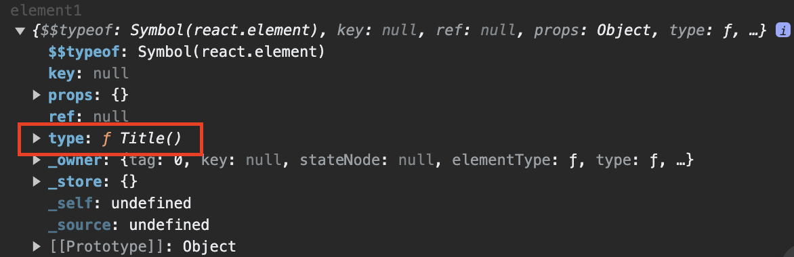
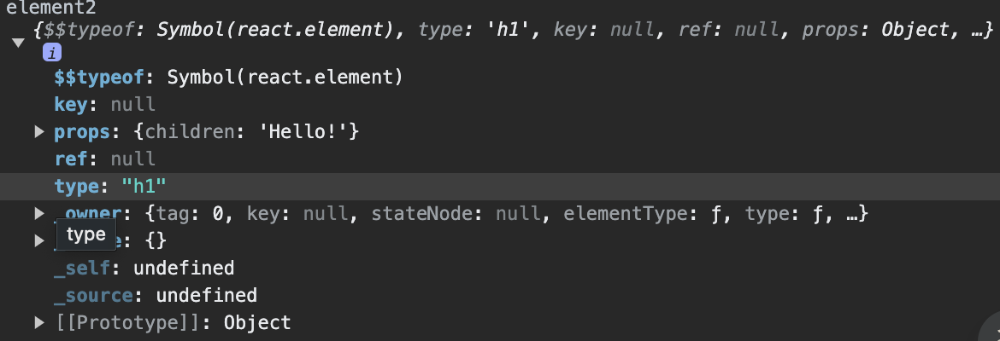

import CodeSandbox from "../../../src/components/mdx/CodeSandbox.jsx";

## component

簡單來說就是畫面的藍圖，component 就是由開發者自行定義好的商業邏輯、特定的樣式、React Element 畫面所組成的，就如同蓋房子一樣，如果說應用程式是一棟房子，那麼 component 就是搭建成房子的不同建材：鋼筋、水泥、磚頭...，透過組合這些 component 而逐步組成應用程式的畫面，同時 component 是可以重複使用的，讓程式碼變得更容易維護與管理。

例如：設計一個 TodoList 的應用程式，可以將 TodoList 拆分成由多個 `<TodoItem />` 元件所組成的 `<TodoList/>` 元件，雖然 `<TodoItem />`這個元件是重用的，但每一個 `<TodoItem />` 都有其各自的元件狀態。

```jsx title="TodoItem.jsx"
const TodoItem = ({ todo }) => {
  return <li>{todo}</li>;
};
```

```jsx title="TodoList.jsx"
const TodoList = () => {
  const todos = ["Todo 1", "Todo 2", "Todo 3"];
  return (
    <div>
      <h1>Todo List</h1>
      <ul>
        {todos.map((todo, index) => (
          <TodoItem key={`${todo}-${index}`} todo={todo} />
        ))}
      </ul>
    </div>
  );
};
```

## props？ 為什麼 props 是唯讀的？

props 指的就是呼叫 component 時會傳入 component 的屬性，而 props 的資料型別在 React 中沒有任何限制。當 component 接收到從外部傳入的 props 後，就可以根據 props 去產生相對應的客製化的畫面或是商業邏輯。

```jsx title="TodoItem.jsx"
// highlight-next-line
const TodoItem = ({ title, isDone }) => {
  //將接收到的 props 使用解構取出屬性資料，這樣也就可以賦值到區域變數中
  return(
    <li>
      <input type='checkbox' id={title} name={title} checked={isDone} />
      <label htmlFor={title}>{title}</label>
    </li>;
  )
};
```

```jsx title="TodoList.jsx"
const TodoList = () => {
  const todos = [
    {
      title: "Todo 1",
      isDone: false,
    },
    {
      title: "Todo 2",
      isDone: true,
    },
    {
      title: "Todo 3",
      isDone: false,
    },
  ];
  return (
    <div>
      <h1>Todo List</h1>
      <ul>
        {todos.map((todo, index) => (
          <TodoItem
            key={`${todo}-${index}`}
            // highlight-start
            title={todo.title} //將 title 屬性傳入 <TodoItem/>
            isDone={todo.isDone} //將 isDone 屬性傳入 <TodoItem/>
            // highlight-end
          />
        ))}
      </ul>
    </div>
  );
};
```

props 的特性是唯讀的，這是因為 React 的核心概念是單向資料流，所以當資料以 props 屬性傳遞到 components 內部時，為了確保資料的源頭與可追蹤性，以維持單向資料流的特性，所以 props 是不可以被修改的，因為當 props 被手動修改時，我們就無法確定資料的來源是從哪裡來的，也可能會出現無法預期的錯誤。

## component 的 render 與 re-render

component 的一次 render 指的是 react 呼叫 component function 後產生描述一段畫面的 React Element 的結果。又 react virtual dom 為樹狀資料結構，當父 component 中包含一個或是多個子 component 時，當父 component render 時，其所包含的子 component 就會跟著進行一次的 render ，將所 render 完成的 react element 裝回上一層的父 component 上，整個過程是由上而下，會一直持續遍歷到最底層的 component，最後會拼裝成一個完整樹狀結構的 react element。

re-render 則指的是當 component 的 props 或 state 資料發生變化時，react 會重新呼叫 component function 並重新 render 一次，會根據新的原始資料重新產生一份新的 react element，並透過 diff 演算法比對新舊的 react element，找出差異的部分，最後再進行 DOM 更新。

### re-render 的時機點：

1. component 本身 `setState` 更新資料
2. 父層 component 資料更新傳入子 component
3. Content provider 的 component 更新時

## 為什麼 component 命名中的首字母必須為大寫？

原是負責轉譯 react jsx transpiler 的 babel 會去根據首字母的大小寫去決定要轉譯成哪一種標籤類型。

- 首字母為小寫： transpiler 會將其當作是字串並且傳入 `React.createElement()`方法作為第一個參數，ex: `React.createElement('div')`。最後取得實際相對的 DOM 元素。

- 首字母為大寫： transpiler 會將其當作是變數名稱，會判斷為 component function 並且傳入 `React.createElement()`方法作為第一個參數，ex: `React.createElement(Hello)`。最後取得一段描述畫面的 React Element。

## 正確呼叫 component 的方式

有一個 component function 如下：

```jsx
function MyComponent() {
  return <h1>Hello!</h1>;
}
```

`<MyComponent />` 和 `{ MyComponent() }`有什麼差異？

```jsx
const element1 = <MyComponent />;
console.log(element1); //印出來會是 <MyComponent />;
```

當 `const element1 = <MyComponent />;` 這行被執行完成後，`MyComponent` component function 其實還沒有被呼叫到。

```jsx
const element1 = <MyComponent />;
const element2 = MyComponent();
console.log("element1", element1);
console.log("element2", element2);
```

1. `<MyComponent />`

```jsx
const element1 = <MyComponent />;
console.log("element1", element1);
```



2. `{MyComponent()}`

```jsx
const element2 = MyComponent();
console.log("element2", element2);
```



這兩者種呼叫的方式差異在於：

- `<MyComponent />`:

  - Component 類型的 react component 有延遲執行的特性，
    當程式碼執行到 `<MyComponent />` 會先告訴 react 這個父 component 有什麼結構，在 return 完成後會去 reconciler 觀察是否轉換成 DOM element，之後才會交給 renderer 去處理 DOM element。

  - `<MyComponent />`在這裡的意義就是告訴 react 我想要在這裡產生一個 MyComponent 實例/ Fiber Node，但其實還沒有被呼叫，真正被呼叫是等父 component 建立 React element 後、描述完畫面才會進行呼叫子 component。

- `MyComponent()`:

  - React 會將它視為是一個普通的 function，當程式碼執行到 `MyComponent()` 會立即執行 `MyComponent()`。在 runtime 時 JavaScript engine 分辨不出來要建立一個 component 實例，只是會單純作為描述 React element 的表達式。
  - React 並不會將 `MyComponent()` 視為 component，而且也不應該將 call `MyComponent()` 去呼叫 component，原因在於 component 能夠帶有 state 是因為 react 對 hook 加料，所以當以不正確的方式去呼叫 component 時，就不是在 React 機制底下運作，進而導致 hook 壞掉，產生難以追蹤的 bug。

```jsx
const MyComponent = () => {
  return (
    <div>
      <h1>Hello World</h1>
    </div>
  );
};

function App() {
  return (
    <main>
      {MyComponent()}
      <MyComponent />
    </main>
  );
}

export default App;
```

上方的程式碼其實就等同於：

```jsx
function App() {
  return (
    <main>
      {
        <div>
          <h1>Hello World</h1>
        </div>
      }
      <MyComponent />
    </main>
  );
}

export default App;
```

### React 延遲呼叫特性

一定要使用 `React.createElement()` 產生 component 才能要求 react 去延遲呼叫 component function 和產生 component 實例，延遲呼叫的好處是可以在內容未更動的情況下避免 re-render。

將子 component 定義在 父 component 的外部並且使用 `{}` 的方式呼叫，當父 component 因狀態更新而 re-render 時，子 component 會因被 react 判斷為同一個 component 所以不會重新 render。
例子：

<CodeSandbox codeSandboxId="all-compoent-m36qz8?layout=%257B%2522sidebarPanel%2522%253A%2522EXPLORER%2522%252C%2522rootPanelGroup%2522%253A%257B%2522direction%2522%253A%2522horizontal%2522%252C%2522contentType%2522%253A%2522UNKNOWN%2522%252C%2522type%2522%253A%2522PANEL_GROUP%2522%252C%2522id%2522%253A%2522ROOT_LAYOUT%2522%252C%2522panels%2522%253A%255B%257B%2522type%2522%253A%2522PANEL_GROUP%2522%252C%2522contentType%2522%253A%2522UNKNOWN%2522%252C%2522direction%2522%253A%2522vertical%2522%252C%2522id%2522%253A%2522clvdx88xq00063b6jopw379v7%2522%252C%2522sizes%2522%253A%255B100%252C0%255D%252C%2522panels%2522%253A%255B%257B%2522type%2522%253A%2522PANEL_GROUP%2522%252C%2522contentType%2522%253A%2522EDITOR%2522%252C%2522direction%2522%253A%2522horizontal%2522%252C%2522id%2522%253A%2522EDITOR%2522%252C%2522panels%2522%253A%255B%257B%2522type%2522%253A%2522PANEL%2522%252C%2522contentType%2522%253A%2522EDITOR%2522%252C%2522id%2522%253A%2522clvdx88xq00023b6jgabzj7lc%2522%257D%255D%257D%252C%257B%2522type%2522%253A%2522PANEL_GROUP%2522%252C%2522contentType%2522%253A%2522SHELLS%2522%252C%2522direction%2522%253A%2522horizontal%2522%252C%2522id%2522%253A%2522SHELLS%2522%252C%2522panels%2522%253A%255B%257B%2522type%2522%253A%2522PANEL%2522%252C%2522contentType%2522%253A%2522SHELLS%2522%252C%2522id%2522%253A%2522clvdx88xq00033b6j335wgwcz%2522%257D%255D%252C%2522sizes%2522%253A%255B100%255D%257D%255D%257D%252C%257B%2522type%2522%253A%2522PANEL_GROUP%2522%252C%2522contentType%2522%253A%2522DEVTOOLS%2522%252C%2522direction%2522%253A%2522vertical%2522%252C%2522id%2522%253A%2522DEVTOOLS%2522%252C%2522panels%2522%253A%255B%257B%2522type%2522%253A%2522PANEL%2522%252C%2522contentType%2522%253A%2522DEVTOOLS%2522%252C%2522id%2522%253A%2522clvdx88xq00053b6jnfsof8pq%2522%257D%255D%252C%2522sizes%2522%253A%255B100%255D%257D%255D%252C%2522sizes%2522%253A%255B50%252C50%255D%257D%252C%2522tabbedPanels%2522%253A%257B%2522clvdx88xq00023b6jgabzj7lc%2522%253A%257B%2522tabs%2522%253A%255B%257B%2522id%2522%253A%2522clvdx88xp00013b6jgryjlq92%2522%252C%2522mode%2522%253A%2522permanent%2522%252C%2522type%2522%253A%2522FILE%2522%252C%2522filepath%2522%253A%2522%252Fsrc%252Findex.js%2522%257D%255D%252C%2522id%2522%253A%2522clvdx88xq00023b6jgabzj7lc%2522%252C%2522activeTabId%2522%253A%2522clvdx88xp00013b6jgryjlq92%2522%257D%252C%2522clvdx88xq00053b6jnfsof8pq%2522%253A%257B%2522tabs%2522%253A%255B%257B%2522id%2522%253A%2522clvdx88xq00043b6j6s1i1d8u%2522%252C%2522mode%2522%253A%2522permanent%2522%252C%2522type%2522%253A%2522UNASSIGNED_PORT%2522%252C%2522port%2522%253A0%252C%2522path%2522%253A%2522%252F%2522%257D%255D%252C%2522id%2522%253A%2522clvdx88xq00053b6jnfsof8pq%2522%252C%2522activeTabId%2522%253A%2522clvdx88xq00043b6j6s1i1d8u%2522%257D%252C%2522clvdx88xq00033b6j335wgwcz%2522%253A%257B%2522tabs%2522%253A%255B%255D%252C%2522id%2522%253A%2522clvdx88xq00033b6j335wgwcz%2522%257D%257D%252C%2522showDevtools%2522%253Atrue%252C%2522showShells%2522%253Afalse%252C%2522showSidebar%2522%253Atrue%252C%2522sidebarPanelSize%2522%253A15%257D" />

從中可以發現 App component 因為點擊的 button 而更新了 count 的 state，資料驅動畫面更新，在執行到 `{Child}` 的時候 ChildComponent 並不會跟著 re-render，接著執行至 `<ChildComponent />` ChildComponent 就會進行 re-render 重新建立一個 React element ，這是因為即使 `<ChildComponent />` 長相一樣，但其時它們的 reference 是不同的，所以 react 會判斷為不同的 component。

### React 如何判斷是不是一個 component 實例

在上方曾提到過負責轉譯 jsx 的 transpiler 是透過首字母的大寫去判斷 component function ，但是對於 React 來說，React 則是透過呼叫方式來判斷，首字母的大小寫定義對 React 來說並沒有意義。

```js
const foo = () => {
  return <div />;
};
```

使用 `React.createElement `方法來呼叫 `foo` ，會被 React 視為是一個 component 實例。但是不能被放在 JSX 語法中，因為 transpiler 會將其視為是一個字串，試圖轉換成 DOM element。

所以 React 判斷為一個 component 實例的方式是一定要透過 React element 的方式呼叫 component function。ex: `<Component/>`。使用 React element 呼叫才能讓 react 去 `React.createElement `方法產生 component 實例達成延遲呼叫的特性，可以從 component 實例取出資料並且讓 hook 正常運作，另外也可以藉由 React 內建的優化機制檢查在兩次 render 過程中是否為同一個 component 類型，近而減少避免不必要的 re-render。
