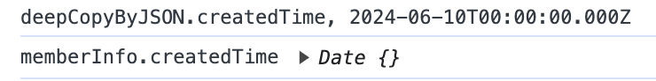
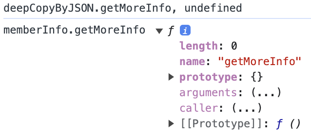
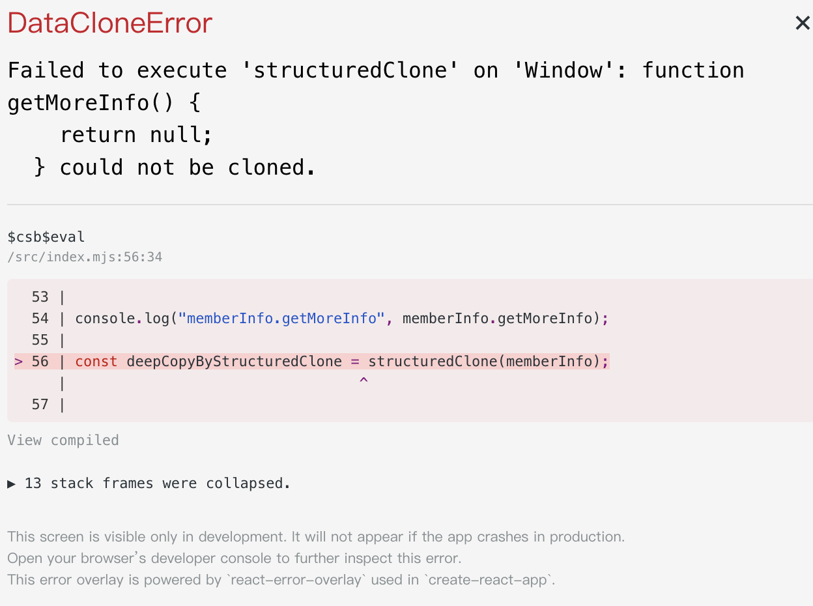
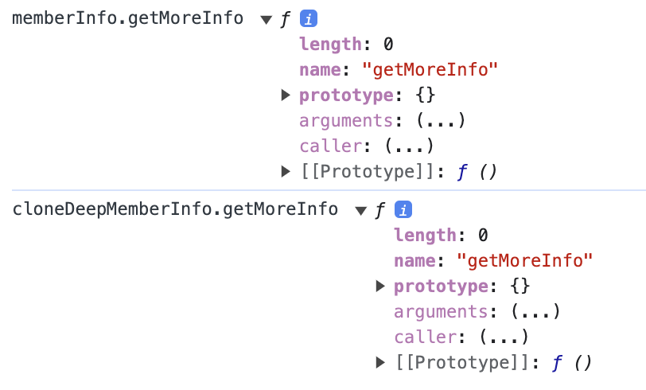
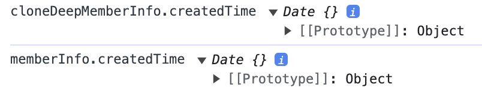

import CodeSandbox from "../../../src/components/mdx/CodeSandbox.jsx";

## Shallow clone 與 deep clone 的區別

首先要講到 Javascript 「物件傳址」的特性，在 Javascript 中物件在建立的時候會將記憶體的位址賦予至變數上，常常有多個變數共用同一個位址，所以 mutate 其中一個物件的屬性的內容時，其他的變數也會受到影響，就是因為他們共用同一個記憶體位址。

## Shallow clone

Shallow clone 又稱淺複製，當想要將物件重新賦予至另外一個物件的時候又不想要修改其原始值，就可以使用 Shallow clone **將物件內第一層的屬性複製到另外一個 reference 上**，這樣既原來的物件的 reference 不同，也可以避免修改到原始物件的屬性。

### Shallow clone 的方法

#### [spread 語法](https://developer.mozilla.org/en-US/docs/Web/JavaScript/Reference/Operators/Spread_syntax)

```js
const memberInfo = {
  id: 120,
  name: "Andy",
  isVip: false,
  birthday: "1996/01/12",
  hobbies: ["Photography", "Cooking", "Painting"],
};

const copyBySpread = { ...memberInfo }; //使用 spread 語法複製物件 memberInfo

console.log("copyBySpread === memberInfo", copyBySpread === memberInfo); //false
//可以確定 copyBySpread 與 memberInfo 這兩個物件的 reference 不同的

console.log(
  "copyBySpread.hobbies === memberInfo.hobbies",
  copyBySpread.hobbies === memberInfo.hobbies,
); //true

//memberInfo 中的 hobbies 屬性是一個陣列，物件的比對 === 就是其記憶體的位址，
//可以確定 copyBySpread 與 memberInfo 這兩個物件的 hobbies 這個屬性都是指向同一個 reference 的，
//所以當修改 copyBySpread.hobbies 的內容時，也會影響到 memberInfo.hobbies 的內容。
```

那如果想要淺複製物件內巢狀的物件或物件可以這麼做：

```js
const copyNestBySpread = {
  ...memberInfo, //先淺複製 memberInfo 第一層的屬性
  hobbies: [...memberInfo.hobbies], //在 copyNestBySpread 物件中新增 hobbies 屬性，然後將 memberInfo.hobbies 陣列淺複製到 copyNestBySpread.hobbies
};

//這時候再次檢查 copyNestBySpread.hobbies 與 memberInfo.hobbies 的 reference 是否相同
console.log(
  "copyNestBySpread.hobbies === memberInfo.hobbies",
  copyNestBySpread.hobbies === memberInfo.hobbies,
); //false
// 這時候修改 copyNestBySpread.hobbies 的內容就不會影響到 memberInfo.hobbies 的內容
```

使用 spread 展開運算符的好處是語法相對簡潔，讓程式碼容易閱讀。

#### [Object.assign()](https://developer.mozilla.org/zh-TW/docs/Web/JavaScript/Reference/Global_Objects/Object/assign)

```js
const memberInfo = {
  id: 120,
  name: "Andy",
  isVip: false,
  birthday: "1996/01/12",
  hobbies: ["Photography", "Cooking", "Painting"],
};

const copyByAssign = Object.assign({}, memberInfo); ////使用 Object.assign() 複製物件 memberInfo

console.log("copyByAssign === memberInfo", copyByAssign === memberInfo); //false

console.log(
  "copyByAssign.hobbies === memberInfo.hobbies",
  copyByAssign.hobbies === memberInfo.hobbies,
); //true
```

## Deep clone

Deep clone 又稱深複製，相對淺複製僅是將物件的第一層複製，深複製則是將物件的所有層級都複製一份，深複製當遇到巢狀物件或是陣列時，就會進行深層的遍歷，將每一次層的值都進行複製，如此一來複製出來的物件當被修改時就不會影響到原來的物件。

### Deep clone 的方法

#### `JSON.parse(JSON.stringify(...))`

```js
const memberInfo = {
  id: 120,
  name: "Andy",
  isVip: false,
  birthday: "1996/01/12",
  hobbies: ["Photography", "Cooking", "Painting"],
};

//先將 memberInfo 物件轉換成 JSON 字串，再將 JSON 字串轉換成物件
function deepCopy(item) {
  return JSON.parse(JSON.stringify(item));
}

const deepCopyByJSON = deepCopy(memberInfo);

console.log("deepCopyByJSON === memberInfo", deepCopyByJSON === memberInfo); //false
console.log(
  "deepCopyByJSON.hobbies === memberInfo.hobbies",
  deepCopyByJSON.hobbies === memberInfo.hobbies,
); //false
```

但是使用 `JSON.parse(JSON.stringify(...))` 進行深複製時，如果物件內的屬性有不可以序列化的值，就會導致深複製失敗。ex: `undefined`、`function`、`symbol`、`BigInt`、`Date`、`RegExp`、`Error`、`Map`、`Set`

```js
const memberInfo = {
  id: 120,
  name: "Andy",
  isVip: false,
  birthday: "1996/01/12",
  hobbies: ["Photography", "Cooking", "Painting"],
  getMoreInfo: function getMoreInfo() {
    return null;
  },
  createdTime: new Date("2024-06-10"),
};

function deepCopy(item) {
  return JSON.parse(JSON.stringify(item));
}

const deepCopyByJSON = deepCopy(memberInfo);
```


`deepCopyByJSON.createdTime`跟`memberInfo.createdTime`的值就不同了，因為`Date`物件無法被序列化。


`deepCopyByJSON.getMoreInfo`的值為 undefined，因為 function 也無法被序列化。

#### `structuredClone(value)`

```js
const memberInfo = {
  id: 120,
  name: "Andy",
  isVip: false,
  birthday: "1996/01/12",
  hobbies: ["Photography", "Cooking", "Painting"],
};
//使用 structuredClone 深複製物件 memberInfo
const deepCopyByStructuredClone = structuredClone(memberInfo);

console.log(
  "deepCopyByStructuredClone.hobbies === memberInfo.hobbies",
  deepCopyByStructuredClone.hobbies === memberInfo.hobbies
);//false

`deepCopyByStructuredClone.hobbies` 跟 `memberInfo.hobbies` 的 reference 不同
```

但是同樣的 `structuredClone` 也無法處理 `function`、`Date`、`RegExp`、`Error`、`Map`、`Set` 等不可序列化的值。

```js
const memberInfo = {
  id: 120,
  name: "Andy",
  isVip: false,
  birthday: "1996/01/12",
  hobbies: ["Photography", "Cooking", "Painting"],
  getMoreInfo: function getMoreInfo() {
    return null;
  },
  createdTime: new Date("2024-06-10"),
};

const deepCopyByStructuredClone = structuredClone(memberInfo);
```


當物件內有不可序列化的值時，直接使用`structuredClone` 就會直接報錯。

#### 手寫遞迴函式

```js
//map（用於存儲已複製物件的 WeakMap），在 WeakMap 中，鍵必須是物件。

function cloneDeep(obj, map = new WeakMap()) {
  //如果 map 中已經有 obj 的複製，則直接返回該複製。這可以防止循環參照導致的無窮遞歸。
  if (map.has(obj)) {
    return map.get(obj);
  }

  //首先排除非物件類型的，檢查傳入的 obj 是否為 null 或是原始型別，這是因為這些類型的值在 JavaScript 中是按值傳遞的，所以不需要複製。
  if (obj === null || typeof obj !== "object" || typeof value === "function") {
    return obj;
  }

  //如果 obj 是 Date 的實例，則創建一個新的相同的 Date 實例並返回。
  if (obj instanceof Date) return new Date(obj);

  //如果 obj 是 RegExp 的實例，則創建一個新的相同的 RegExp 實例並返回。
  if (obj instanceof RegExp) return new RegExp(obj);

  //函式輸出 output 值，如果 obj 是陣列，則輸出為空陣列，如果 obj 是一個普通物件，則 output 的原型會被設置為 obj 的原型，以保留原型鏈。

  const output = Array.isArray(obj)
    ? []
    : Object.create(Object.getPrototypeOf(obj));

  //將 obj 和 output 的對應關係存入 map
  map.set(obj, output);

  //使用 Reflect.ownKeys(obj) 獲取 obj 的所有自有屬性鍵（包括符號和不可枚舉的屬性）
  //遍歷所有的鍵，對每個鍵對應的值進行深度複製，並將複製的結果存入 output。
  for (const key of Reflect.ownKeys(obj)) {
    const val = obj[key];
    //對當前鍵對應的值進行深度複製，並將複製的結果存入 output。
    output[key] = cloneDeep(val, map);
  }
  return output;
}

const memberInfo = {
  id: 120,
  name: "Andy",
  isVip: false,
  birthday: "1996/01/12",
  hobbies: ["Photography", "Cooking", "Painting"],
  getMoreInfo: function getMoreInfo() {
    return null;
  },
  createdTime: new Date("2024-06-10"),
};

const cloneDeepMemberInfo = cloneDeep(memberInfo);

console.log("cloneDeepMemberInfo.getMoreInfo", cloneDeepMemberInfo.getMoreInfo);
console.log("memberInfo.getMoreInfo", memberInfo.getMoreInfo);

console.log("cloneDeepMemberInfo.createdTime", cloneDeepMemberInfo.createdTime);
console.log("memberInfo.createdTime", memberInfo.createdTime);
```




## 為什麼以 deep clone 來進行物件或陣列資料的 immutable update 不是一個好方法?

簡單來說，使用 deep clone 操作物件資料會使 React 效能優化機制失效。

這裡就舉一個例子來進行說明

<CodeSandbox codeSandboxId="immutable-update-shallow-deep-clone-forked-8rgd8d?file=%2Fsrc%2FApp.jsx%3A20%2C29&layout=%257B%2522sidebarPanel%2522%253A%2522EXPLORER%2522%252C%2522rootPanelGroup%2522%253A%257B%2522direction%2522%253A%2522horizontal%2522%252C%2522contentType%2522%253A%2522UNKNOWN%2522%252C%2522type%2522%253A%2522PANEL_GROUP%2522%252C%2522id%2522%253A%2522ROOT_LAYOUT%2522%252C%2522panels%2522%253A%255B%257B%2522type%2522%253A%2522PANEL_GROUP%2522%252C%2522contentType%2522%253A%2522UNKNOWN%2522%252C%2522direction%2522%253A%2522vertical%2522%252C%2522id%2522%253A%2522clvkron4200063b6iily2ii69%2522%252C%2522sizes%2522%253A%255B100%252C0%255D%252C%2522panels%2522%253A%255B%257B%2522type%2522%253A%2522PANEL_GROUP%2522%252C%2522contentType%2522%253A%2522EDITOR%2522%252C%2522direction%2522%253A%2522horizontal%2522%252C%2522id%2522%253A%2522EDITOR%2522%252C%2522panels%2522%253A%255B%257B%2522type%2522%253A%2522PANEL%2522%252C%2522contentType%2522%253A%2522EDITOR%2522%252C%2522id%2522%253A%2522clvkron4200023b6if4n611kn%2522%257D%255D%257D%252C%257B%2522type%2522%253A%2522PANEL_GROUP%2522%252C%2522contentType%2522%253A%2522SHELLS%2522%252C%2522direction%2522%253A%2522horizontal%2522%252C%2522id%2522%253A%2522SHELLS%2522%252C%2522panels%2522%253A%255B%257B%2522type%2522%253A%2522PANEL%2522%252C%2522contentType%2522%253A%2522SHELLS%2522%252C%2522id%2522%253A%2522clvkron4200033b6impvz28zp%2522%257D%255D%252C%2522sizes%2522%253A%255B100%255D%257D%255D%257D%252C%257B%2522type%2522%253A%2522PANEL_GROUP%2522%252C%2522contentType%2522%253A%2522DEVTOOLS%2522%252C%2522direction%2522%253A%2522vertical%2522%252C%2522id%2522%253A%2522DEVTOOLS%2522%252C%2522panels%2522%253A%255B%257B%2522type%2522%253A%2522PANEL%2522%252C%2522contentType%2522%253A%2522DEVTOOLS%2522%252C%2522id%2522%253A%2522clvkron4200053b6i1eep83jr%2522%257D%255D%252C%2522sizes%2522%253A%255B100%255D%257D%255D%252C%2522sizes%2522%253A%255B50%252C50%255D%257D%252C%2522tabbedPanels%2522%253A%257B%2522clvkron4200023b6if4n611kn%2522%253A%257B%2522tabs%2522%253A%255B%257B%2522id%2522%253A%2522clvkron4200013b6iidkrwdor%2522%252C%2522mode%2522%253A%2522permanent%2522%252C%2522type%2522%253A%2522FILE%2522%252C%2522filepath%2522%253A%2522%252Fsrc%252Findex.js%2522%252C%2522state%2522%253A%2522IDLE%2522%257D%252C%257B%2522id%2522%253A%2522clvlpejjd00023b6i228pr0my%2522%252C%2522mode%2522%253A%2522permanent%2522%252C%2522type%2522%253A%2522FILE%2522%252C%2522initialSelections%2522%253A%255B%257B%2522startLineNumber%2522%253A20%252C%2522startColumn%2522%253A29%252C%2522endLineNumber%2522%253A20%252C%2522endColumn%2522%253A29%257D%255D%252C%2522filepath%2522%253A%2522%252Fsrc%252FApp.jsx%2522%252C%2522state%2522%253A%2522IDLE%2522%257D%255D%252C%2522id%2522%253A%2522clvkron4200023b6if4n611kn%2522%252C%2522activeTabId%2522%253A%2522clvlpejjd00023b6i228pr0my%2522%257D%252C%2522clvkron4200053b6i1eep83jr%2522%253A%257B%2522tabs%2522%253A%255B%257B%2522id%2522%253A%2522clvkron4200043b6ibahll584%2522%252C%2522mode%2522%253A%2522permanent%2522%252C%2522type%2522%253A%2522UNASSIGNED_PORT%2522%252C%2522port%2522%253A0%252C%2522path%2522%253A%2522%252F%2522%257D%255D%252C%2522id%2522%253A%2522clvkron4200053b6i1eep83jr%2522%252C%2522activeTabId%2522%253A%2522clvkron4200043b6ibahll584%2522%257D%252C%2522clvkron4200033b6impvz28zp%2522%253A%257B%2522tabs%2522%253A%255B%255D%252C%2522id%2522%253A%2522clvkron4200033b6impvz28zp%2522%257D%257D%252C%2522showDevtools%2522%253Atrue%252C%2522showShells%2522%253Afalse%252C%2522showSidebar%2522%253Atrue%252C%2522sidebarPanelSize%2522%253A15%257D" />

`React.memo()` 是一個效能優化的方法，它將 component 包裹起來，每當有 props 傳入 component 時會使用 `Object.is（）` 檢查這次的 props 與前次的 props 是否相同，當 component 的 props 沒有變動時，就不會重新 render，這樣可以避免不必要的 re-render，提升效能。

在這個例子中，App component 中有一個被 memo() 包裹住的 Child component。

### 使用 deep clone 進行 state 更新

```jsx
import { memo, useState } from "react";

function Child({ fooObj }) {
  console.log("render Child");
  return <h1>child: {fooObj.b}</h1>;
}

const MemoizedChild = memo(Child);

export default function App() {
  console.log("render App");
  const [data, setData] = useState({
    count: 0,
    foo: { b: 100 },
  });

  const updateCountWithDeepClone = () => {
    // 使用 deep clone 複製 data 物件並且賦值給 newData
    const newData = structuredClone(data);
    // 更新 newData 的 count 屬性
    newData.count += 1;
    // 更新 data 的 state
    setData(newData);
  };

  return (
    <div>
      <h2>count: {data.count} </h2>
      <button onClick={updateCountWithDeepClone}>
        Update Count With Deep Clone
      </button>
      <MemoizedChild fooObj={data.foo} />
    </div>
  );
}
```

當 component 第一次 mounted 掛載至瀏覽器後：

1. 點擊 Update Count With Deep Clone button

2. 會呼叫 `updateCountWithDeepClone function`

3. 在 `updateCountWithDeepClone function` 中會使用 `structuredClone` 進行 deep clone data 物件並且賦值給 newData

4. 更新 newData 的 count 屬性

5. 更新 data 的 state

6. React 會執行 `Object.is() ` 檢查發現 state 更新了

7. 進入 component reconciliation 階段，執行 App function 產生以 props 和 state 描述 component 畫面的 react element，這時就會印出 `render App`。

8. 將新版本所產生的 react element 與上一次 render 的舊版 react element 進行樹狀結構的比較，找出差異就是 state，然後更新 `<h2>count: {data.count} </h2>`。

9. 當執行到 `<MemoizedChild fooObj={data.foo} />` 時，雖然 `data.foo` 的值看似沒有改變，但是 React 發現 props 有變，當 App Component render 完成後，就會執行 memoized Child component function，這時會印出 `render Child`。

這是因為使用了 deep Clone 更新了 state 資料，又 deep Clone 所將物件中每一層的每一個屬性都經過遍歷複製，即使沒發生更新的內層資料也會產生全新的參考，因此，此時當使用 `object.is()` 檢查傳入 `<MemoizedChild fooObj={data.foo} />` 的 props 時，就會發現 props 有變動，所以會重新 re-render，進而印出 `render Child`。

從上述可以知道，對於 React 來說，使用 deep clone 進行 state 更新會使得某些 React 效能優化的手段失效，導致每一次 state 的更新都是全新的物件、全新的參考，即使該屬性的值沒有變更，而使得效能優化機制失去參考相等性。

### 使用 shallow clone 進行 state 更新

```jsx
import { memo, useState } from "react";

function Child({ fooObj }) {
  console.log("render Child");
  return <h1>child: {fooObj.b}</h1>;
}

const MemoizedChild = memo(Child);

export default function App() {
  console.log("render App");
  const [data, setData] = useState({
    count: 0,
    foo: { b: 100 },
  });

  const updateCountWithShallowClone = () => {
    setData({
      ...data,
      count: data.count + 1,
    });
  };

  return (
    <div>
      <h2>count: {data.count} </h2>
      <button onClick={updateCountWithShallowClone}>
        Update Count With Shallow Clone
      </button>
      <MemoizedChild fooObj={data.foo} />
    </div>
  );
}
```

當 component 第一次 mounted 掛載至瀏覽器後：

1. 點擊 Update Count With Shallow Clone button

2. 會呼叫 `updateCountWithShallowClone function`

3. 在 `updateCountWithShallowClone function` 中會展開運算符淺複製 data 物件，然後更新 count 屬性，最後 setState 更新 data 的 state。

4. 更新 count 屬性

5. 最後 setState 更新 data 的 state

6. React 會執行 `Object.is()` 檢查發現 state 更新了

7. 進入 component reconciliation 階段，執行 App function 產生以 props 和 state 描述 component 畫面的 react element，這時就會印出 `render App`。

8. 將新版本所產生的 react element 與上一次 render 的舊版 react element 進行樹狀結構的比較，找出差異就是 state，然後更新 `<h2>count: {data.count} </h2>`。

最後的執行結果就是傳入 `<MemoizedChild fooObj={data.foo} />` 的 props 並沒有變動，所以不會重新 re-render，也就不會印出 `render Child`，只有 App component 會重新 render。

對於 React 來說資料比較機制就是為了減少重複產生 react element 的次數，React 不需要知道實際的資料細節，檢查原始型別時直接互比值、檢查物件時只需要比對參考是否相同，當物件資料的參考相同，React 就會當作資料沒變，不管物件內容如何改變，React 都不會重新產生新的 react element 來 render，因此更新 state 時不應該 mutate 原始資料，而是應該產生新的物件這樣就會產生一個新的 Reference，透過 shallow clone 複製原始物件的屬性到新的物件，只要根據更新的部分去修改相對應的值，這樣既不會 mutate 到原始資料，維持物件 immutable，也可以提供 React 效能優化機制參考的相等性。
